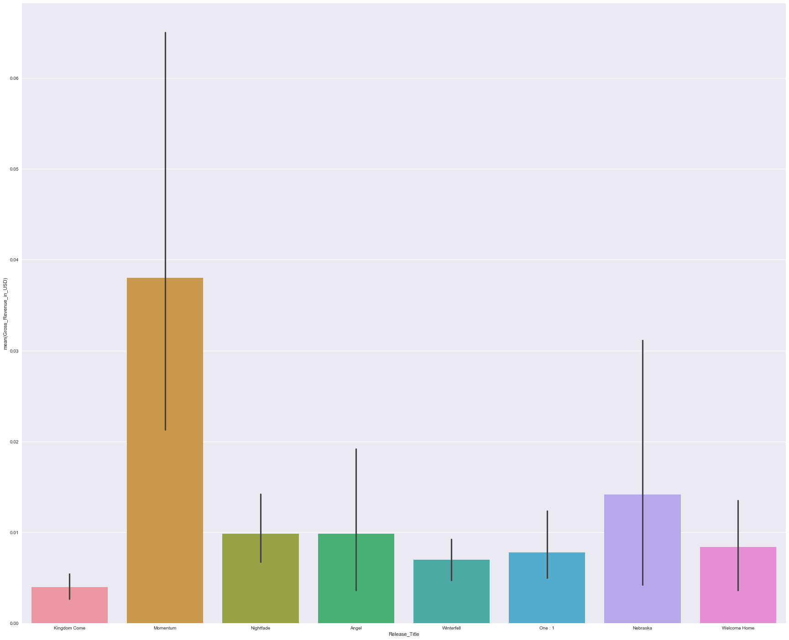
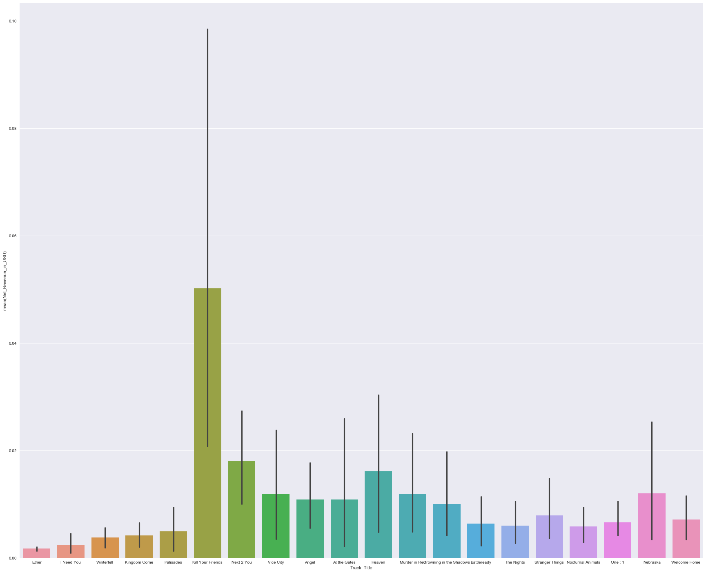
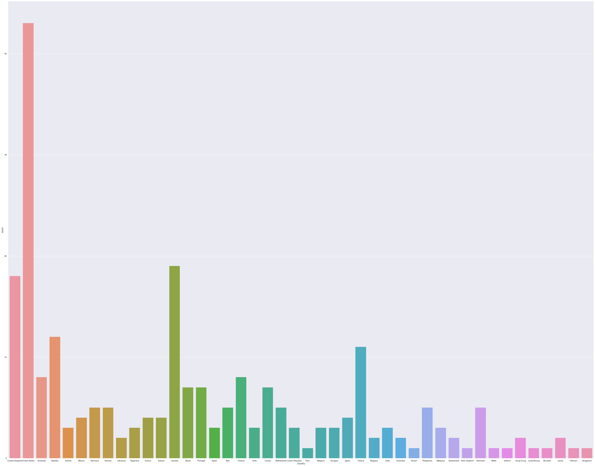
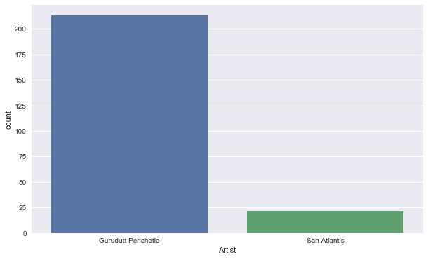
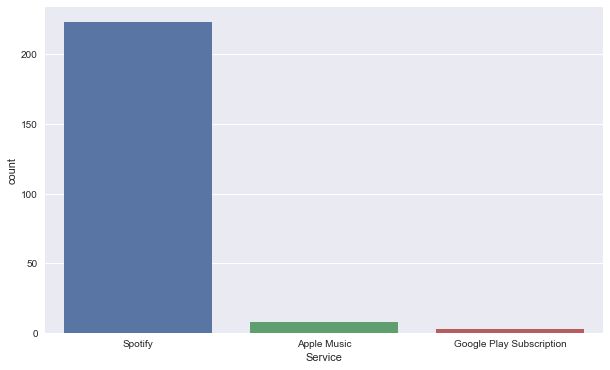

# Spotify-Analysis-October-2017

This is an insight into statistics of my Spotify Artist Accounts.

Links: [Gurudutt Perichetla](https://open.spotify.com/artist/3s5cmywpL5c4WNgPU4KutH)

       [San Atlantis](https://open.spotify.com/artist/4EFol2d4u9HF5tO2vPSdCe)

Here, I have analyzed information from a statement from my music distributor. The statement is in the form of a comma-separated values file with columns - "Artist", "Country", "Release_Title", to say the least.

With the help of Python Libraries such as Matplotlib, Seaborn, Numpy and Pandas I have generated plots to analyze the trends.

The first plot I had made was "Release_Title" against "Gross_Revenue_in_USD".

Here, you can see which album was more popular and which was streamed the most and streamed the least.

The second plot is "Track_Title" against "Net_Revenue_in_USD",

Here, you can see which track was more popular and which was streamed the most and streamed the least.

Then, I did a Countplot for countries to find out in which country I had the most listeners.

Similarly, I did a Countplot for my artist profiles' popularity.

I had obtained results from another Countplot for various services - Spotify, Apple Music and Google Play Music.

If you're interested in my findings, you can visit this link: [Article](https://medium.com/@guruduttperi/why-spotify-is-the-1-streaming-platform-for-artists-fc11ce37c4c1)
